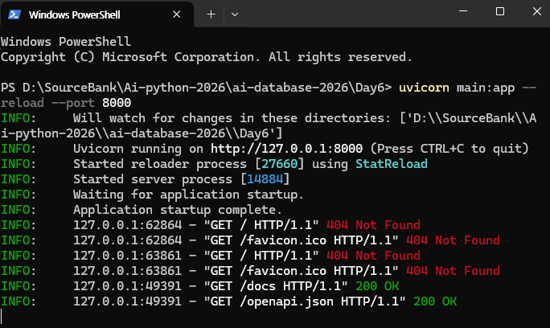

## Create New Repository

## <links>
https://wikidocs.net/book/18202
https://wikidocs.net/book/18203
https://www.erdcloud.com/myPage

<다운로드>
- 파이썬
- DBeaver
- Docker
- VS Code
- Node
- Postgresql
- VS Code Insiders

*Download Python: click add python.exe to PATH & use admin privileges -> customize install -> unclick documentation(?) -> click install python for all users -> disable path length limit (window만 260 character limit 있음) 
*다운로드 확인: D드라이브 파일만든곳에 terminal 열고, "code ." 
VS code에서 터미널 열고 python 치고 확인.
* VS code에서 Markdown Editor 확장자 받아도 됨 (이미지 첨가 가능). README 오른쪽마우스 -> open with markdown editor

*Download Docker Desktop

<단축키>
Python 디버깅없이 실행: ctrl + F5
Jupyter 실행은: ctrl + enter
VS code에서 ctrl + shift + v -> 미리보기
Toggle/주석:  ctrl+shift on python
Python F12 잘활용하기 (connection 확인 및 설명)

<New Terms>
Docker: 

<팁>
- 파이썬에는 숫자크기 제한 없음
- ( ) means a function call, or grouping values/expressions
- [ ] means indexing or accessing an item.
- 딕셔너리 {키 : 값}
- 집합 sets ={} 은 중복허용 안함, 리스트는 중복허용 함
- 마크다운에서 # + [스페이스] -> 실행하면 마크다운됨
- Jypyter 실행은 ctrl + enter
- Jypyter cell/shell 만들기는 b 누름
- 파이썬에서 True/ False는 대문자로 시작해야함

-database는 github의 .gitignore에 올릴게 없음 (다 텍스트 베이스)

-If문 안의 if문 vs. If문+ and/or/not 

-----------------------
<SQL>
- database 는 대소문자 구분 없음

- Insert 한 후 꼭 updated row 가 1이 됐는지 확인

- dBeaver는 열 사이에 공백이 없어야 실행됨. 한 prompt는 enter 없이.

- OUTER JOIN : Left outer join/ Right outer join 뒤에 쓰는 table 기준!!!
ex: Left outer join은 왼쪽 테이블 기준으로 오른쪽 테이블에 연결되지 않은 데이터도 나옴, Right outer join은 left outer join 과 반대

- group by 는 select * 와 함께 사용 안됨.

- Transaction: commit된 데이터는 장애가 발생해도 보존된다.
- Manual commit 모드로 항상 바꾸고 시작
- Rollback 중요! 데이터를 넣었을 때 오류뜨면 복구 과정이 중요하다.
- Update 또는 Delete 전에 begin 쓰고 시작하기! 단, create table할때는 auto commit으로 하고 manual로 바꿔야함.
- 한번 commit 한 것은 다시 roll back 안됨. 한번 roll back 된 것은 다시 commit 안됨.
- 기억하기: Auto commit 상태에서 테이블 생성 --> manual commit --> begin, commit, rollback

<Fast API>
#### 
- Terminal (When starting FastAPI, 2 python.exe will be starting)
- URL 주소는 전부 Get method (post 사용 불가). Post method는 Swagger UI

** Tips: 
- opening a terminal in the folder on VsCode  =  open the Folder > open terminal 

- Python code 적다가 error 뜨는데 잠깐 자리비울때 pass 적고 감

- Python에도 commit & rollback 기능
conn.commit & conn.rollback

