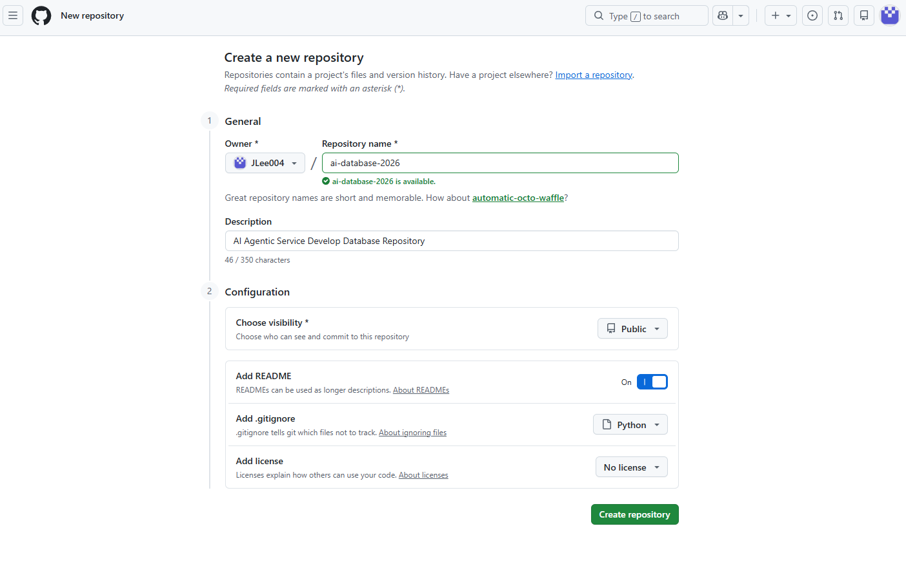

## Create New Repository

## <links>
https://wikidocs.net/book/18202
https://wikidocs.net/book/18203

*Download Python: click add python.exe to PATH & use admin privileges -> customize install -> unclick documentation(?) -> click install python for all users -> disable path length limit (window만 260 character limit 있음) 
*다운로드 확인: D드라이브 파일만든곳에 terminal 열고, "code ." 
VS code에서 터미널 열고 python 치고 확인.
* VS code에서 Markdown Editor 확장자 받아도 됨 (이미지 첨가 가능). README 오른쪽마우스 -> open with markdown editor

*Download Docker Desktop

<단축키>
Python 디버깅없이 실행: ctrl + F5
Jupyter 실행은: ctrl + enter
VS code에서 ctrl + shift + v -> 미리보기

<New Terms>
Docker: 

<팁>
- 파이썬에는 숫자크기 제한 없음
- ( ) means a function call, or grouping values/expressions
- [ ] means indexing or accessing an item.
- 딕셔너리 {키 : 값}
- 집합 sets ={} 은 중복허용 안함, 리스트는 중복허용 함
- 마크다운에서 # + [스페이스] -> 실행하면 마크다운됨
- Jypyter 실행은 ctrl + enter
- Jypyter cell/shell 만들기는 b 누름
- 파이썬에서 True/ False는 대문자로 시작해야함

-database는 github의 .gitignore에 올릴게 없음 (다 텍스트 베이스)

-If문 안의 if문 vs. If문+ and/or/not 

-------
<SQL>
database 는 대소문자 구분 없음