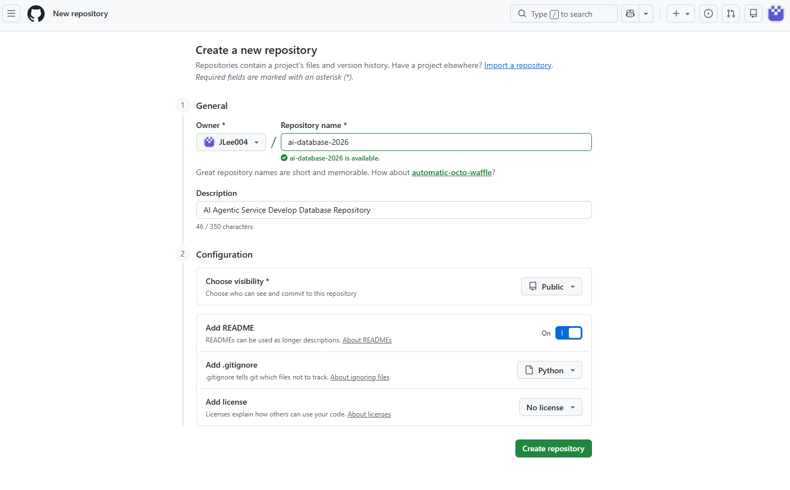
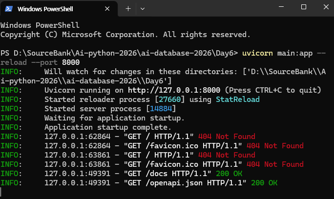

## Create New Repository

## <links>
https://wikidocs.net/book/18202
https://wikidocs.net/book/18203
https://www.erdcloud.com/myPage

<다운로드>
- 파이썬
- DBeaver
- Docker
- VS Code
- Node
- Postgresql
- VS Code Insiders

*Download Python: click add python.exe to PATH & use admin privileges -> customize install -> unclick documentation(?) -> click install python for all users -> disable path length limit (window만 260 character limit 있음) 
*다운로드 확인: D드라이브 파일만든곳에 terminal 열고, "code ." 
VS code에서 터미널 열고 python 치고 확인.
* VS code에서 Markdown Editor 확장자 받아도 됨 (이미지 첨가 가능). README 오른쪽마우스 -> open with markdown editor

*Download Docker Desktop

<단축키>
Python 디버깅없이 실행: ctrl + F5
Jupyter 실행은: ctrl + enter
VS code에서 ctrl + shift + v -> 미리보기
Toggle/주석:  ctrl+shift on python
Python F12 잘활용하기 (connection 확인 및 설명)

<Python Tips>
- 파이썬에는 숫자크기 제한 없음
- ( ) means a function call, or grouping values/expressions
- [ ] means indexing or accessing an item.
- 딕셔너리 {키 : 값}
- 집합 sets ={} 은 중복허용 안함, 리스트는 중복허용 함
- 마크다운에서 # + [스페이스] -> 실행하면 마크다운됨
- Jypyter 실행은 ctrl + enter
- Jypyter cell/shell 만들기는 b 누름
- 파이썬에서 True/ False는 대문자로 시작해야함

-database는 github의 .gitignore에 올릴게 없음 (다 텍스트 베이스)

-----------------------
<SQL>
### What is DB?
- Data Integrity
- Data Stability
- Data Concurrency
- Data Scalability
- Support standard SQL

#### What is Docker?
- Container technology solution that resolves environmental dependency issues
- Provides the ability to run programs in a virtual environment
- Container: an image containing the OS, libraries, settings, and more, bundled into a single package.

| Data Type   | Details          | Example                   |
| ----------- | ---------------- | ------------------------- |
| INT         | Integer          | 10, 25, -9                |
| BEGINT      | Big Integer      | 10000000000000            |
| NUMERIC     |                  | 1233.45                   |
| VARCHAR (n) | Limited String   | 'John' or Resident number |
| TEXT        | Long String (1G) | News post text            |
| BOOLEAN     | T or F           |                           |
| DATE        |                  | 2026-09-15                |
| TIMESTAMP   | Date with time   | 2026-09-15 16:00:20       |
| JSONB       | JSON data        | {"name" : John Doe"}      |

#### CRUD - four basic functions

|        | Meaning              | Query Command |
| ------ | -------------------- | ------------- |
| Create | Create data          | `INSERT`      |
| Read   | Read and search data | `SELECT`      |
| Update | Edit/change data     | `UPDATE`      |
| Delete | Delete data          | `DELETE`      |

##### How to design Table?
- Unnecessary duplicates
- Has a single title for each table
- Has PK that distinguishes each row
- FK connects relationship between tables
- Uses limits/constraint to prevent adding wrong data
- Uses structue for easily accessible to retrieval and making changes
### Table Modeling
- Modeling Tool: ERD (Entity Relationship Diagram) Cloud

#### Conditions 
WHERE, AND, OR, LIKE, NULL

#### Constraint
1. Primary key (PK): Value that represents each row from table - **Unique & Not Null** (No duplicate, Not Null)
2. Foreign Key (FK): A column that references the primary key of another table.
3. Unique Constraint
4. Check Constraint
5. Add constraint
6. Default constraint

#### Join
1. (Inner) join
2. Outer join (Left/right)
* - OUTER JOIN : Left outer join/ Right outer join 뒤에 쓰는 table 기준!!!
ex: Left outer join은 왼쪽 테이블 기준으로 오른쪽 테이블에 연결되지 않은 데이터도 나옴, Right outer join은 left outer join 과 반대

#### Aggregations 
COUNT, SUM, AVG, GROUP BY, HAVING

#### Transaction 
- When all tasks are successfully done -> Commit,
when error occurs -> Rollback
- ACID
* - Transaction: commit된 데이터는 장애가 발생해도 보존된다.
- Manual commit 모드로 항상 바꾸고 시작
- Rollback 중요! 데이터를 넣었을 때 오류뜨면 복구 과정이 중요하다.
- Update 또는 Delete 전에 begin 쓰고 시작하기! 단, create table할때는 auto commit으로 하고 manual로 바꿔야함.
- 한번 commit 한 것은 다시 roll back 안됨. 한번 roll back 된 것은 다시 commit 안됨.
- 기억하기: Auto commit 상태에서 테이블 생성 --> manual commit --> begin, commit, rollback

#### CRUD 
SELECT, INSERT, UPDATE, DELETE

#### Tips for SQL
- database 는 대소문자 구분 없음

- Insert 한 후 꼭 updated row 가 1이 됐는지 확인

- dBeaver는 열 사이에 공백이 없어야 실행됨. 한 prompt는 enter 없이.

- group by 는 select * 와 함께 사용 안됨.

<Fast API>
Web framework making API server with Python
- Return as JSON type from server
- Auto complete UI for text
- use Pydantic 
- easy integrate with DB such as postgreSql, Oracle and MySQL
- Terminal (When starting FastAPI, 2 python.exe will be starting)
- URL 주소는 전부 Get method (post 사용 불가). Post method는 Swagger UI

#### FastAPI additional functions
1. Sync
- ORM (object-relational mapping): can do DB CRUD with soley python coding without SQL query.
- install SQLAlchemy package
2. API Server
- Managing Exceptions
- API server structure
- verification (login and auth)
- JWT (Json Web Token) verification
- Docker deployment

#### Debugging
디버그 단축키들
 - F5: 디버그로 실행
 - F9: 브레이크포인트 토글
 *토글: 활성화 또는 비활성화 되는 전환방식
 - F10: 한단계씩 실행 (함수는 실행하고 패스)
 *F5 먼저 실행 후, F9 브레이크포인트는 실행하려는 코드 앞에 > F5 > F10
 - F11: 한단계씩 실행 (함수내 진입해서 한줄씩 실행)
*VS code 디버깅 아이콘 이용 --> 조사식에서 코드실행/ 변경 미리 보기 및 미리 확인도 가능 (실제로 코드가 변경되는 것은 아님)
* debugging mode는 uvicorn 으로 서버 열어야 디버깅 됌.
* 다른 포트 열려있으면 포트 정보 중복안되게 조심, 같은 포트 경우는 powershell 다 닫고 새로 실행.
* function, spelling, insert check

** Tips: 
- opening a terminal in the folder on VsCode  =  open the Folder > open terminal 

- Python code 적다가 error 뜨는데 잠깐 자리비울때 pass 적고 감

- Python에도 commit & rollback 기능
conn.commit & conn.rollback

- API's results = JSON type, Python's result is Dictionary
- JSON은 "" 씀, Python은 '' 쓴다.

