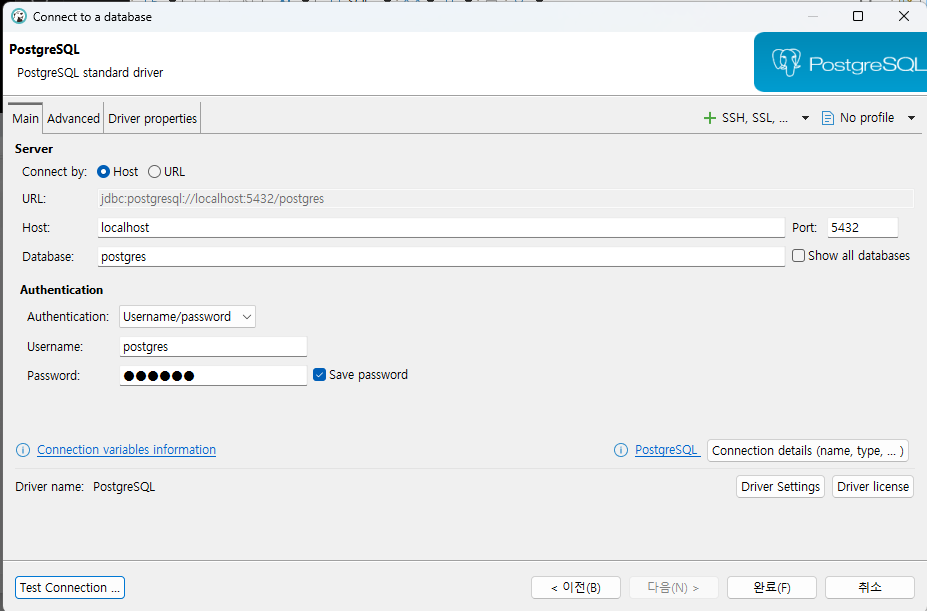
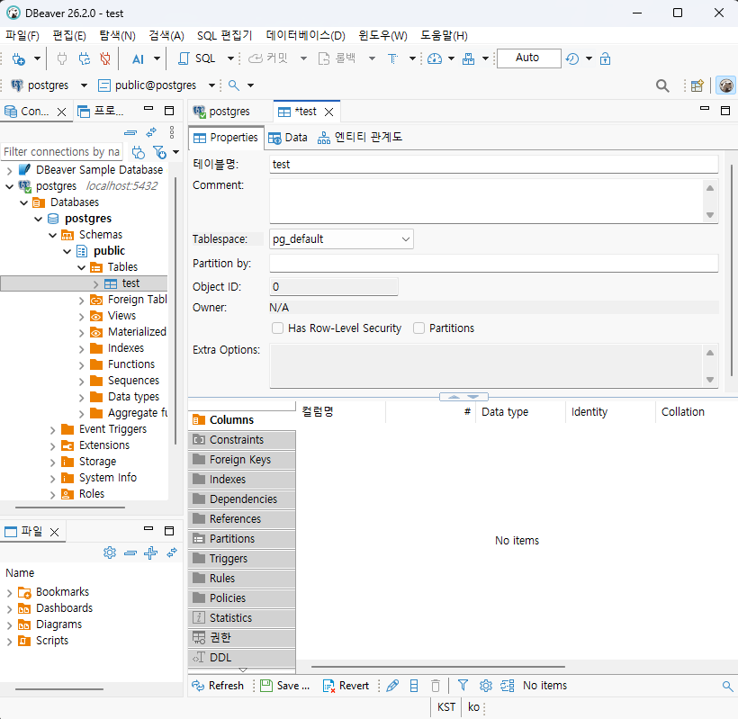
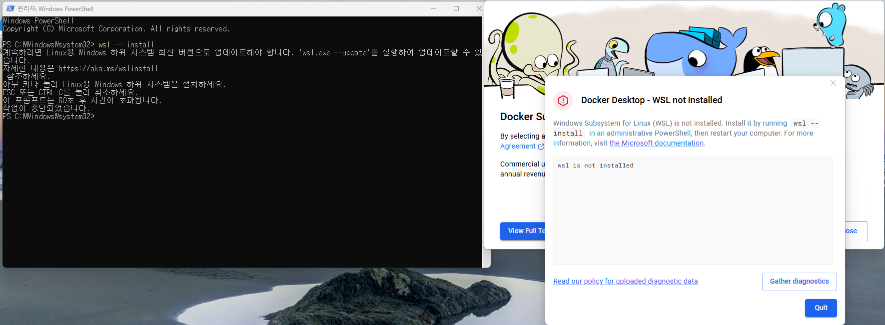
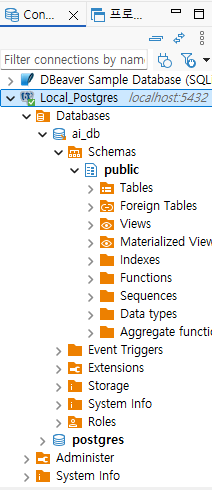
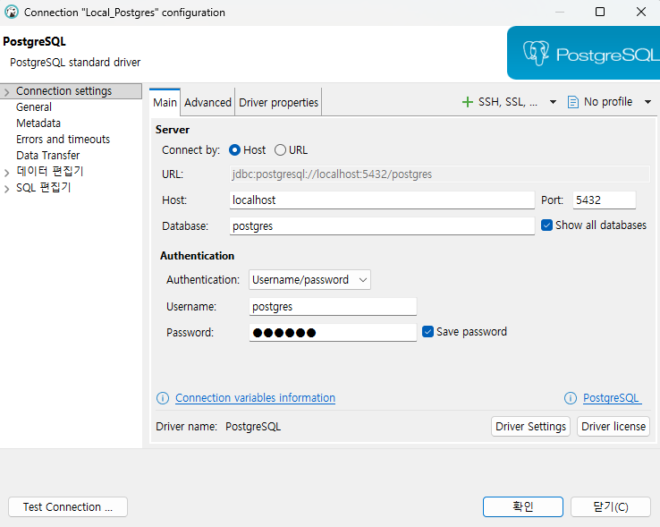
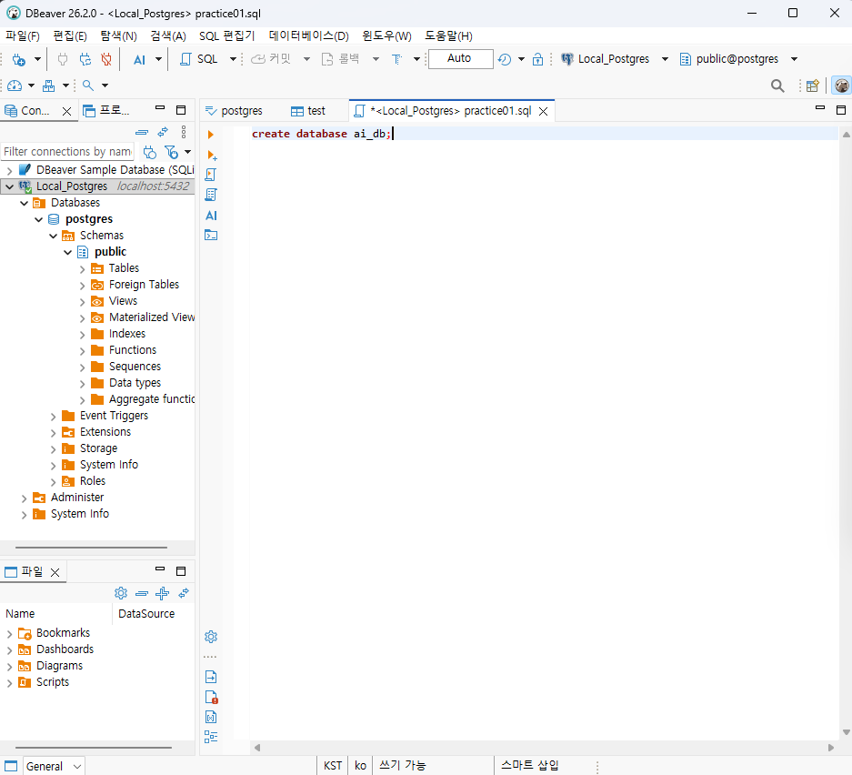
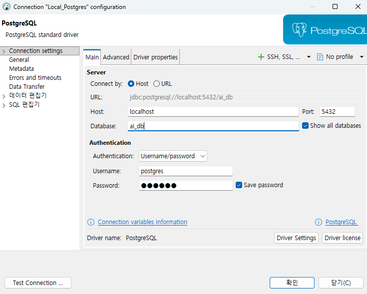
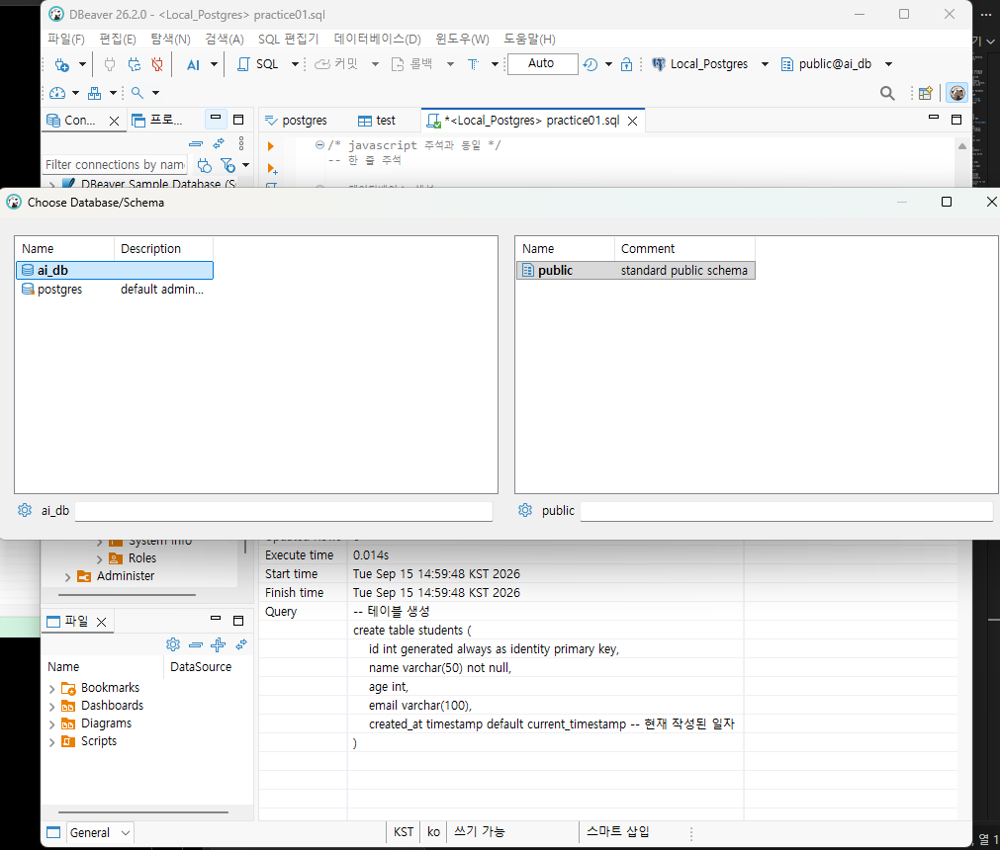
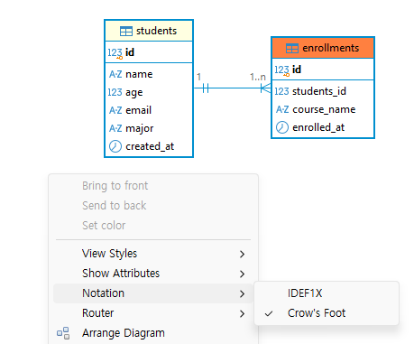
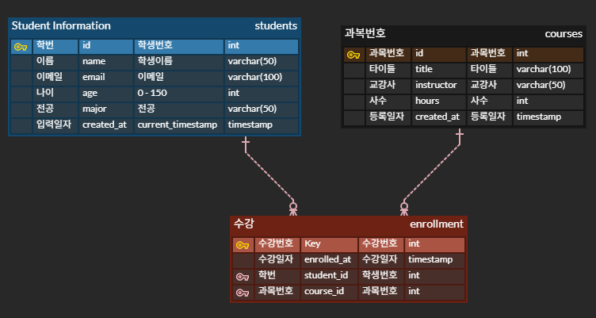

# ai-database-2026

AI Agentic Service Develop Database Repository

### Postgre SQL

Databas: a system managing collected data in a single space
In short, it is called Postgre, and it is **relational** database.
It allows save, edit, delete, and search the data with `SQL`.

- OTher Relational Database
  - Oracle
  - MySQL / MariaDB
  - SQL Server
  - Postgre is an **open source system** --> No license fee 123123

### What is DB?

- Data Integrity
- Data Stability
- Data Concurrency
- Data Scalability
- Support standard SQL

### How to Install PostgreSQL?

- Desktop Download
- superuser ID: postgres, current password: 123456, current port:5432

### Install DBeaver

- GUI DB management tool

#### DBeaver

1. Execute DBeaver
2. Connect New database - click Postgres
3. Install necessary drive and connected
4. Click complete





#### What is Docker?

- Container technology solution that resolves environmental dependency issues
- Provides the ability to run programs in a virtual environment
- Container: an image containing the OS, libraries, settings, and more, bundled into a single package.
- Install Docker Desktop
  

WSL (install Windows subsystem for Linux )

#### Docker Command:

```bash
docker --version
```

#### Download PostgreSQL image

- image: system package that is already existed in docker repository

```bash
docker pull postgres:latest
```

#### Execute Container

```bash
docker run --name my-postgres_PASSWORD-123456 -p 5432:5432 -d postgres:latest
```

#### Connect to DBeaver

### How to use DB?

#### PostgreSQL Structure

- 

#### Create DB

- SQL Editor -> Create database 'new name' ;
- 
- Save as New, save as *.sql
- Write below:

```sql
create database ai_db;
```

- ctrl + Enter to execute query
- 
  *Check on Edit Connection (mouse right click of Local_Postgres) -> click 'show all databases.
- Create database
- To change ai_db (or other) database:
  
  
  --> Refresh/ F5

#### Create table

- Write code below:

```sql
create table students (
	id int generated always as identity primary key, 
	name varchar(50) not null,
	age int,
	email varchar(100),
	created_at timestamp default current_timestamp 
```

Ctrl + enter to execute.

#### Create Data

- Insert query

```sql
insert into public.students (name, age, email)
values ('John Doe', 20, 'johndoe@example.com'),
	   ('Don Bob', 21, 'dbob@gmail.com'),
	   ('Charles Stow', 22, 'cs@gmail.com'),
	   ('Gary Lile', 23, 'gl@gmail.com');
     ```

- Check Query
```sql
select * from public.students;
```

- Edit Query

```sql
update students set
		email = 'johndoe@kakao.com'
 where id = 1;
```

- Delete Query

```sql
delete from students
where name = 'Don Bob';
```

- Select Query

#### Basic Types of Postgres


| Data Type   | Details          | Example                   |
| ----------- | ---------------- | ------------------------- |
| INT         | Integer          | 10, 25, -9                |
| BEGINT      | Big Integer      | 10000000000000            |
| NUMERIC     |                  | 1233.45                   |
| VARCHAR (n) | Limited String   | 'John' or Resident number |
| TEXT        | Long String (1G) | News post text            |
| BOOLEAN     | T or F           |                           |
| DATE        |                  | 2026-09-15                |
| TIMESTAMP   | Date with time   | 2026-09-15 16:00:20       |
| JSONB       | JSON data        | {"name" : John Doe"}      |

### Basic SQL

The basic grammar in database

#### CRUD - four basic functions


|        | Meaning              | Query Command |
| ------ | -------------------- | ------------- |
| Create | Create data          | `INSERT`      |
| Read   | Read and search data | `SELECT`      |
| Update | Edit/change data     | `UPDATE`      |
| Delete | Delete data          | `DELETE`      |

EX: When making a student management program,

- Student registration
- Student list
- Change student information
- Delete student information
  -> these are all columns needed.

0. Check Table and Reset All

```sql
-- Check table
select * from students s ;

-- Reset all Table; Delete all
-- truncate students;
```

1. INSERT

```sql
-- Add student information
-- Do not use " " for string in query!! only ' '
insert into students (name, age, email)
values ('Jamie Simson', 20, 'js.exampel.com');

-- Change column order --> Always match KEYS and VALUES
insert into students (age, email, name)
values (29, 'mj@gmail.com', 'Min Jun');

-- Add multiple data
insert into students (name, age, email)
values ('Gil Soon', 20, 'gs.exampel.com'),
 ('Gil Ja', 50, 'gj.exampel.com'),
 ('Terry Loy', 30, 'gm.exampel.com');
```

2. SELECT (PART 1)

- Retreival with SELECT query
- ```sql

  ```

-- Retrieval only necessary data using Filtering
select * from students s
where s.age <30;

select * from students s
where s."name" = 'Jamie Smile';

select * from students s
where s.age = 21
or s."name" = 'John Doe'

- SELECT -[source](./Day2/practice02.sql)
- Array
- Ascending => ASC
- Descending => DESC

```sql
 -- Order by array
 select * from students s 
  order by id desc;

 select * from students s 
  order by age asc;

 -- Order with multiple conditions
 select * from students s 
  order by name asc, age asc;

 -- Limit view count
 select * from students s 
  order by id desc 
  limit 3;

```

3. UPDATE

- Tips: Be careful updating query without Where clause

4. DELETE

- Tips: Be really careful deleting query without Where clause!

```sql
-- Delete table
delete from students
	where id = 33; -- **if ; is added, it delete all the rows!!!
-- Please do not do:
	--delete from student;
drop table students ;
```

#### Null

- Null means there's no value
  (it doesn't mean 0 or no text '')

#### Create Table  (Part 2)

```sql
CREATE TABLE students (
id INT GENERATED ALWAYS AS IDENTITY PRIMARY KEY, -- basic key(PK): NO duplicate allowed & NOT NULL.
name VARCHAR(50) NOT NULL, -- Name cannot be NULL
age INT, --age can be NULL
email VARCHAR(100), -- can be NULL
major VARCHAR(50), -- can be NULL
created_at TIMESTAMP DEFAULT CURRENT_TIMESTAMP -- 
);

** ##### Different Grammar of PK: auto increment
PostgreSQL:
```id int generated always as identity (auto number increment) 
primary key (assign basic key)
```

MySQL: ```auto_increment```
Oracle: ```identity```

```

##### Null Query

```sql
insert into students (name, age, email, major)
values ('Sung Yoo', 20, 'hugo@example.com', null);

insert into students (name, age, email, major)
values ('Sung Min', null, 'Smin@example.com', null);

insert into students (name)
values ('Choi Sik');
```

##### Null Retrieval Query

```sql
where column is null/ is not null
```

#### Table Design

- means DB and table design
- Table design: Logical design and Physical design
- Choose column and data type
- Basic/primary Key (PK) and Foreign key(FK) conditions
- NOT NULL, UNIQUE, CHECK conditions
- DEFAULT condition

##### How to design Table?

- Deciding the relationship of data to design a table including types of table (columns and rows).
  --> What is a good table?
- Unnecessary duplicates
- Has a single title for each table
- Has PK that distinguishes each row
- FK connects relationship between tables
- Uses limits/constraint to prevent adding wrong data
- Uses structue for easily accessible to retrieval and making changes

##### Exercise: Student Management System


|                   | Details                         | Data type        |
| ----------------- | ------------------------------- | ---------------- |
| Student ID        |                                 | INT, BIGINT      |
| Student Name      | Add String, Required property   | VARCHAR(n), TEXT |
| Email             | String, or Null                 | VARCHAR(n), TEXT |
| Age               | Numeric, limit to less than 150 | INT...           |
| Major             | String                          | VARCHAR(n), TEXT |
| Registration Date | yyyy-mm-dd hh:mm:ss             | DATE, TIMESTAMP  |

- Exact number: Numeric,
  long text: text, date: date, true/false: boolean

#### Constraint

1. Primary key (PK)

Value that represents each row from table - **Unique & Not Null** (No duplicate, Not Null)

2. Foreign Key (FK): A column that references the primary key of another table.

```plaintext
Students
 - id --> PK
 - name

Enrollment
 - id --> PK
 - studnets_id
 - course_name
```

#### Create table and Assign FK

```sql
--Create ERD Table
create table enrollments (
	id int generated always as identity primary key,
	students_id int not null, 
	course_name varchar(100) not null,
	enrolled_at timestamp default current_timestamp,
	constraint fk_enrollments_students
		foreign key (students_id)
		references students(id)
```

##### Entity Diagram - relationship of PK and FK



#### 

### Constaint

- If a Column is PK, it will give an error when inserting data without it.
- If one of the row in a column is empty, it cannot be NOT NULL. To fix this, insert all empty ones in the column then change to NOT NULL column.

#### UNIQUE constraint

:prevent duplicates

#### CHECK constraint

:prevents

##### Add CHECK constraint:

#### DEFAULT Constraint

```sql
created_at timestamp default current default current_timestamp
```

### Table Modeling

| Relationship      | detail        | example                   |
| ----------------- | ------------- | ------------------------- |
| 1:multiple        | multiple rows | Student and enrollment    |
| 1:1               |               | user and user information |
| multiple:multiple |               | students and subjects     |
- multiple:multiple relationship is hard to execute -> seperate into 1: multiple tables

- Modeling Tool: ERD (Entity Relationship Diagram) Cloud



### JOIN
1. Inner Join = Join
- Only give me rows where both tables have a match.
- Check table relationship and join with PK and FK
```sql
select s.id "student id", s."name" "student name", s.email, s.major,
	e.id "enrollment id", e.enrolled_at,
	c.id "course id", c.title, c.instructor, c.hours 
 from students s 
join enrollments e 
on s.id = e.student_id 
join courses c 
on c.id = e.course_id ;
```
2. Outer Join
Retrieval even though a condition is not matched.

### Transaction 
- When all tasks are successfully done -> Commit,
when error occurs -> Rollback
- ACID


Table modeling — how to decide what tables you need
Primary/foreign keys
Conditions — WHERE, AND, OR, LIKE, NULL
Constraints — PRIMARY KEY, FOREIGN KEY, UNIQUE, NOT NULL
JOINs — especially INNER JOIN vs LEFT JOIN
Aggregations — COUNT, SUM, AVG, GROUP BY, HAVING
CRUD — SELECT, INSERT, UPDATE, DELETE

[다음][text](readme2.md)
