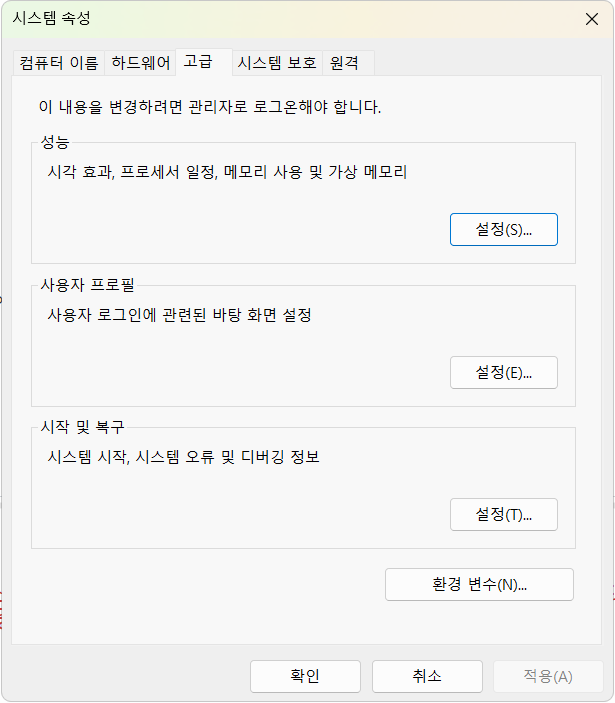
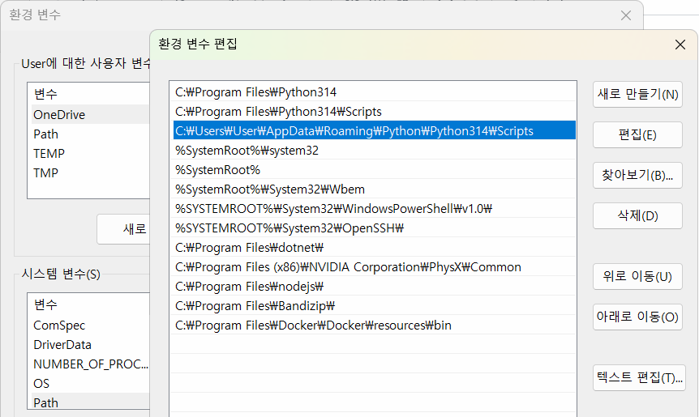
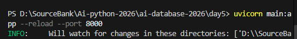
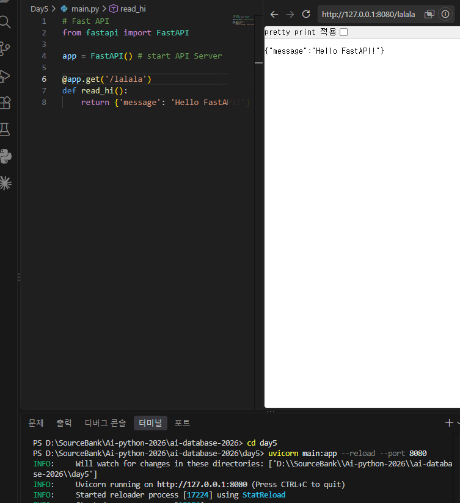
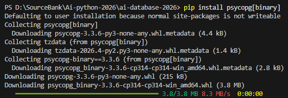
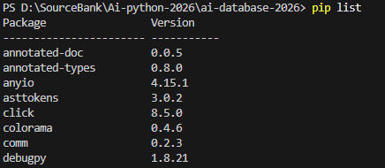
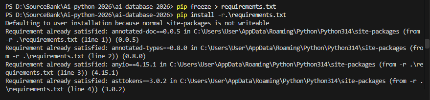
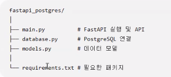
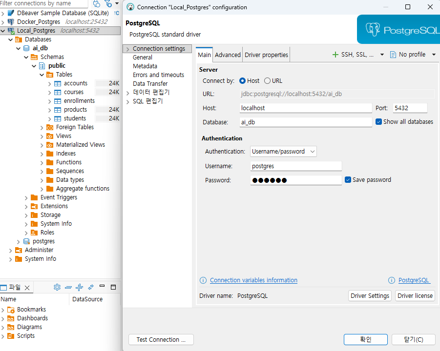

## FastAPI 

FastAPI - Web framework making API server with Python
- Client requests -> FastAPI handle the request and return the result
- Return as JSON type from server
- Auto complete UI for text
- use Pydantic 
- easy integrate with DB such as postgreSql, Oracle and MySQL

### FastAPI Package Installation
1. install fastapi uvicorn (package to develop api) in VS code's terminal
```bash
pip install fastapi uvicorn
```
2. Check the installation
```bash
pip list
```
### Fundamental FastAPI Server
1.  write a source in VS code (save a file 'main.py')
```bash
from fastapi import FastAPI

app = FastAPI()

@app.get('/')
def read_root():
    return {'message':'Hello FastAPI'}
```
2. VS Code restart

3. Problem solving:
Check: installed uvicorn.exe and python saved in same location
--> Find location of uvicorn.exe and register the path
--> sysdm.cpl -> Environment Variable -> In System Variable, double click Path -> add the path of uvicorn.exe in the System Variable -> reopen VS code -> In VS code terminal, type uvicorn -> then type cd 'filename' -> type dir -> type below (can change the port) to start FastAPI server -> Check the result (message) and local host ip address
```bash
uvicorn main:app --reload --port 8000
```
* --reload: automatically restart as soon as modified
 --port 8000: assign a port 

cd {assign file directory}




  --> Click the link with ctrl key.



### Web Response Code
- 200: OK
- 404: client error
- 500: internal server error

### Swagger UI 
- test page for FastAPI (provided automatically)
- http(s):

###
- API's results = JSON type, Python's result is Dictionary
- JSON은 "" 씀, Python은 '' 쓴다.

### URL Path
- 

### HTTP(s) Method
GET, POST, PATCH, PUT, DELETE
- POST and PATCH : cleient should 

### Requst
- FastAPI, use pydantic package model 
- JSON data는 Null, Python은 None 

### HTTP Exception
- 200 --> request successful, 201 --> creation successful
- 403 --> not authorized, 404 --> no data
- 500 --> server error

### Structure of syncing database with FastAPI

fastapi_postgres

├── main.py          # FastAPI 웹 서버

└── database.py      # PostgreSQL 연결

1. Install psycopg : pip install psycopg[binary]


2. pip list to check all the package downloaded


3. share my development environment (python) with other people.

4. re-install development environment

-> python version should be matched. 

* It's easier to seperate the py for team work. 


### create database.py
To connect with database, check the right information by checking dBeaver


### create main.py


### Debugging
디버그 단축키들
 - F5: 디버그로 실행
 - F9: 브레이크포인트 토글
 *토글: 활성화 또는 비활성화 되는 전환방식
 - F10: 한단계씩 실행 (함수는 실행하고 패스)
 *F5 먼저 실행 후, F9 브레이크포인트는 실행하려는 코드 앞에 > F5 > F10
 - F11: 한단계씩 실행 (함수내 진입해서 한줄씩 실행)
*VS code 디버깅 아이콘 이용 --> 조사식에서 코드실행/ 변경 미리 보기 및 미리 확인도 가능 (실제로 코드가 변경되는 것은 아님)

- 기존 FastAPI 코드 외 아래의 디버그 코드 추가
```python
import uvicorn

if__name__ == '__main__':
    uvicorn.run(
        'main:app',
        host='127.0.0.1',
        port=8000,
        related=True,
        log_level='debug'
    )
```
* debugging mode는 uvicorn 으로 서버 열어야 디버깅 됌.
* 다른 포트 열려있으면 포트 정보 중복안되게 조심, 같은 포트 경우는 powershell 다 닫고 새로 실행.
* function check
* spelling check
* insert check

### FastAPI additional functions
1. Sync
- ORM (object-relational mapping): can do DB CRUD with soley python coding without SQL query.
- install SQLAlchemy package
2. API Server
- Managing Exceptions
- API server structure
- verification (login and auth)
- JWT (Json Web Token) verification
- Docker deployment
